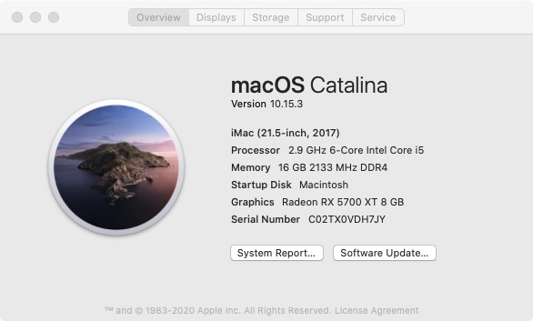
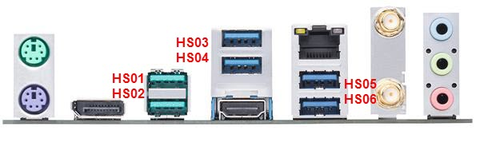

# hackintosh_asus_z390

### Before the build
The trigger of this build is that I need a Mac with powerful graphic card for video editing (final cut Pro). At the beginning, I want to recycle my [H270+i5-7500](H270.md) for the purpose to save some money. Not clever enough to get the job done. Finally purchased new motherboard and CPU and get the rig done.

### Hardware

See my [Hardware List](HARDWARE.md)

### What's Working/What's Not

##### Working
- Ethernet
- Onboard Audio (including digital audio)
- APFS
- Sleep/Wake
- All USB ports (speed not tested)
- ~~iMessage~~ currently facing weird login issue
- App Store
- ~~Facetime~~
- ~~Handoff~~
- Bluetooth & Wi-Fi (via Broadcom adapter [link](https://www.amazon.com/fenvi-Continuity-BCM94360CD-1750Mbps-Beamforming/dp/B07VCCZS54))
- ~~Unlock with Apple Watch~~
- Airdrop
- ~~AirPlay~~
- Apple Music (iTunes)

##### Not Working
- Built-in wifi.
- Onboard Bluetooth is hit or miss. However, I disabled it (HS14) because I have a natively supported Broadcom BCM94360CS2 WIFI/BT adapter.
- ~~Netflix DRM in Safari (works in Chrome)~~

### Step By Step Instructions

This build is "Vanilla". I used [this guide](https://hackintosh.gitbook.io/-r-hackintosh-vanilla-desktop-guide/) as a starting point.

I also refer to this reddit [post](https://www.reddit.com/r/hackintosh/comments/ck0c0d/build_i59400f_16gb_ram_asus_tuf_z390plus_gaming/) a lot since I almost followed it for the hardware purchase.

I followed this [youtube video](https://www.youtube.com/watch?v=Mx151kKaJt0&list=PL-0Dm191lc7bpRLJZWmyNpdZDsVUtu28q) to create the bootable thumbdrive and I recommend you to do the same if this is your first time.

This [Chinese post](https://blog.daliansky.net/Common-problems-and-solutions-in-macOS-Catalina-10.15-installation.html) also helped me solve a few issues which will be mentioned later.

The tutorial/instruction above are much better than anything I can compose so I won't try to embarrass myself. But I want to write about a few setbacks I encountered during the installation:

1. After boot with Clover to install the OS, the screen stuck at SMCSuperIO. The same issue was reported online but their issue seems related to [this](https://hackintosh.gitbook.io/-r-hackintosh-vanilla-desktop-guide/config.plist-per-hardware/coffee-lake#explanation) which I did add.
Then I think this might be caused I installed FakeSMC.kext. After I delete all kext and follow [youtube video](https://www.youtube.com/watch?v=Mx151kKaJt0&list=PL-0Dm191lc7bpRLJZWmyNpdZDsVUtu28q) exactly, the issue is gone. [screen picture](images/SMCSuperIO.jpg)
2. After the first issue resolved, the installation process went further but the screen turns into black in the end. The solution is add "agdpmod=pikera" in boot args.
3. After the second issue resolved, I can successfully format the disk and start the installation. But the loading bar stuck at the final 2min mark. This seems caused by inaccurate memory fix kext. There are a few options here, I start with aptiomemoryfix. I plan to try "OsxAptioFix2Drv.efi or OsxAptioFix2Drv-free2000.efi".

### USB Port Map & SSDT

I use [USBMap](https://github.com/corpnewt/USBMap) and follow step-by-step Instructions [link](https://www.youtube.com/watch?v=j3V7szXZZTc).

If you use the same MB as mine the following annotated IO diagram may save you some time. The case I use is NZXT s340 and the two front USB ports are HS09 (right-side) and HS10 (left-side). The tool shows that HS12 is occupied by BT controller. So I leave it unblocked.

I enabled both front USB ports and all rear USB ports except HS05. My USB.plist and kext can be found in this repo if you want to use.
